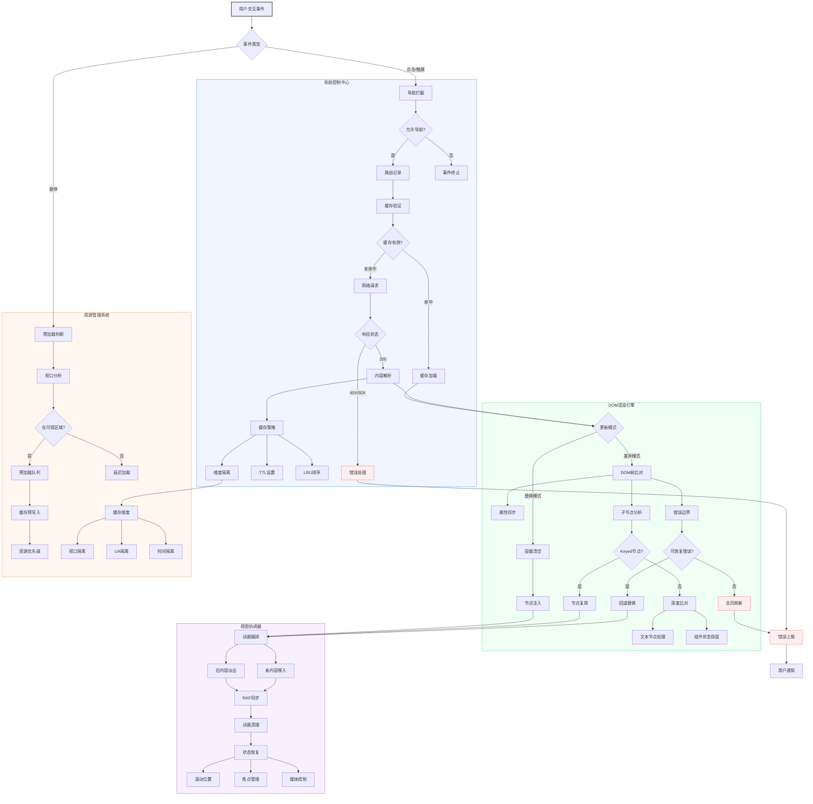
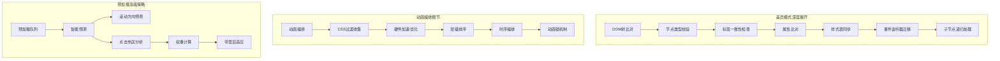
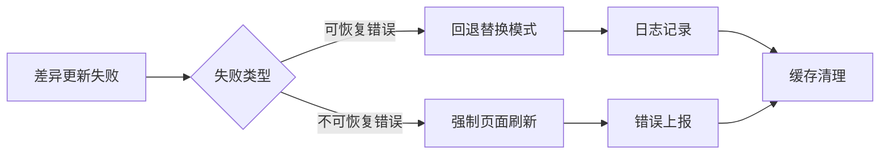

# TurboFeLy

现代化的界面无刷新加载库兼原生 SPA 加速库，提供比传统Pjax更智能的解决方案。通过拦截导航事件、智能缓存管理和差异DOM更新，实现类单页应用的流畅体验。

[从Pjax迁移到TurboFeLy](qianyi.md)

[](https://opensource.org/licenses/MIT)


## 核心升级亮点

### 智能渲染引擎
- **混合更新策略**：支持完整替换与节点级差异更新
- **DOM稳定性保护**：自动回退机制+深度限制
- **跨文档兼容**：安全处理XML命名空间节点
- **动画编排系统**：原子化CSS过渡管理

### 性能优化体系
- **三级缓存系统**：LRU淘汰+TTL过期+条件隔离
- **请求竞态控制**：自动中止重复/过期请求
- **资源预加载**：基于视口预测的按需预取
- **滚动管理**：视图状态持久化恢复

### 工程化支持
- **完整TypeScript类型**
- **生命周期Hook系统**
- **调试工具集成**
- **移动端优化补丁**

## 安装指南

### CDN引入
```html
<!-- 生产环境 -->
<script src="https://cdn.jsdelivr.net/npm/turbofely@latest/src/turbofely.js"></script>

<!-- ESM模块 -->
<script type="module">
  import TurboFeLy from 'https://cdn.jsdelivr.net/npm/turbofely@latest/src/turbofely.esm.js'
</script>
```

### NPM安装
```bash
npm install turbofely
```
```javascript
// ES Module
import TurboFeLy from 'turbofely'

// CommonJS
const TurboFeLy = require('turbofely')
```

## 核心配置参考

### 基础配置
| 参数 | 类型 | 默认值 | 说明 |
|------|------|--------|------|
| `container` | string | `#main-container` | 内容容器选择器 |
| `linkSelector` | string | `a[href]:not([data-turbo-disable])` | 拦截链接选择器 |
| `animate` | boolean | `true` | 启用过渡动画 |
| `animationDuration` | number | `300` | 动画时长(ms) |

### 缓存配置
| 参数 | 类型 | 默认值 | 说明 |
|------|------|--------|------|
| `cacheSize` | number | `10` | 最大缓存条目 |
| `cacheTTL` | number | `900000` | 缓存有效期(ms) |
| `cacheByViewport` | boolean | `false` | 按视口隔离缓存 |
| `cacheByUserAgent` | boolean | `false` | 按UA隔离缓存 |

### 差异更新
| 参数 | 类型 | 默认值 | 说明 |
|------|------|--------|------|
| `updateMode` | string | `replace` | 更新模式(`replace`/`diff`) |
| `diffThreshold` | number | `0.8` | 子节点差异阈值 |
| `maxDiffDepth` | number | `30` | 最大比对深度 |
| `ignoreAttributes` | string[] | `['data-turbo-id']` | 忽略属性列表 |

### 完整默认配置
```javascript
{
  container: '#main-container',
  cacheSize: 10,
  prefetchDelay: 150,
  linkIds: [],
  linkSelector: 'a[href]:not([data-turbo-disable])',
  animate: true,
  animationDuration: 300,
  loadingClass: 'turbo-loading',
  loadingDelay: 200,
  debug: false,
  preventClickDelay: 0,
  updateMode: 'replace',
  fallbackToReplace: true,
  diffThreshold: 0.8,
  maxDiffDepth: 30,
  ignoreAttributes: ['data-turbo-id', 'data-temp'],
  cacheByViewport: false,
  cacheByUserAgent: false,
  cacheTTL: 900000,
  fetchHeaders: { 'X-TurboFeLy': 'true' },
  sameOriginOnly: true
}
```

## 深度使用指南

### 生命周期事件
```javascript
document.addEventListener('turbo:before-navigate', ({ detail }) => {
  console.log('即将导航到:', detail.url)
})

document.addEventListener('turbo:after-update', ({ detail }) => {
  console.log('DOM更新完成, 变化:', detail.changes)
})

document.addEventListener('turbo:diff-error', ({ detail }) => {
  console.error('差异更新失败:', detail.error)
})
```

### 脚本执行规则
- **外链脚本**：自动去重加载
- **内联脚本**：
  - 安全沙箱执行
  - 支持`text/javascript`类型
  - 跳过`data-turbo-ignore`标记的脚本

### 缓存管理API
```javascript
const turbo = new TurboFeLy()

// 清空缓存
turbo.clearCache()

// 获取缓存快照
const cacheEntries = Array.from(turbo.cache.entries())

// 预加载指定URL
turbo.prefetch('/about')

// 手动记录滚动位置
turbo.recordScrollPosition()
```

### 移动端优化
- **点击延迟处理**：自动识别300ms延迟问题
- **触控样式补丁**：
  ```css
  [data-turbo-touch] a {
    min-height: 44px; /* 可触控区域优化 */
    touch-action: manipulation;
  }
  ```

## 高级开发接口

### 扩展差异算法
```javascript
class CustomTurbo extends TurboFeLy {
  shouldReplaceNodes(oldNode, newNode) {
    // 自定义节点替换逻辑
    return super.shouldReplaceNodes(oldNode, newNode)
  }

  syncAttributes(oldNode, newNode) {
    // 扩展属性同步逻辑
    super.syncAttributes(oldNode, newNode)
  }
}
```

### 自定义缓存策略
```javascript
class VersionedTurbo extends TurboFeLy {
  generateCacheKey(url) {
    return `${super.generateCacheKey(url)}|v=${this.appVersion}`
  }
}
```

### 动画定制
```css
/* 覆盖默认动画 */
.turbo-animate-out {
  transition: opacity 0.5s, transform 0.5s cubic-bezier(0.4, 0, 0.2, 1);
}

.turbo-animate-in-active {
  transform: translateY(0) scale(1);
}
```

## 最佳实践

### 静态站点配置
```javascript
new TurboFeLy({
  cacheSize: 20,
  prefetchDelay: 100,
  updateMode: 'diff',
  ignoreAttributes: ['data-astro-id']
})
```

### 动态应用配置
```javascript
new TurboFeLy({
  cacheByViewport: true,
  maxDiffDepth: 50,
  diffThreshold: 0.6,
  animationDuration: 500
})
```

### 调试配置
```javascript
new TurboFeLy({
  debug: true,
  fallbackToReplace: false,
  animationDuration: 0
})
```

## 注意事项

1. **兼容性要求**
   - 需要支持ES6的现代浏览器
   - 依赖Fetch API和MutationObserver

2. **SEO优化**
   - 服务端需返回完整HTML
   - 关键内容应包含在容器内

3. **框架集成**
   - Vue/React应在挂载后初始化
   - 使用data-turbo-id保持状态

4. **性能监控**
   ```javascript
   document.addEventListener('turbo:after-update', ({ detail }) => {
     performance.mark('turboUpdateEnd')
   })
   ```

## 图解



