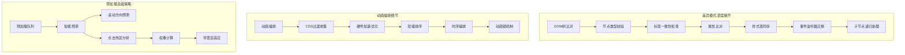
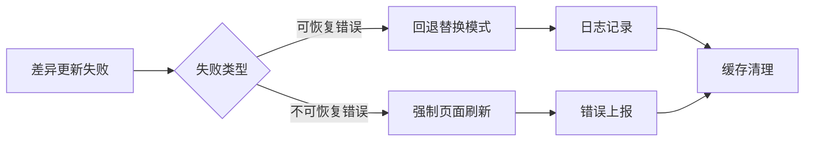

# TurboFeLy

现代化的界面无刷新加载库兼原生 SPA 加速库，旨在提供比 Pjax 更现代化的解决方案。它通过拦截链接点击和表单提交事件，使用 Fetch API 加载页面内容，并在更新 DOM 后执行 JavaScript 代码，从而实现页面的快速加载和流畅过渡。
轻量级前端加速引擎，实现页面快速导航与无缝更新

[](https://opensource.org/licenses/MIT)


## 项目概述

### 核心功能
- **智能预加载**：基于用户行为的链接预加载
- **DOM差异更新**：可配置的节点级差异比对算法
- **多策略缓存**：支持LRU缓存、条件缓存、TTL过期
- **平滑过渡**：CSS动画驱动的内容切换效果
- **完整生命周期**：导航事件与状态管理

### 技术特性
- 零外部依赖
- 支持现代浏览器（ES6+）
- 移动端优先设计
- 可扩展的插件架构

## 快速开始

### 安装
CDN引入：
```html
<script src="https://cdn.jsdelivr.met/npm/turbofely/src/turbofely.js"></script>

<script src="https://cdn.jsdelivr.met/npm/turbofely/src/turbofely.esm.js"></script>
```

NPM安装：
```bash
npm install turbofely
```

### 初始化
```javascript
const turbo = new TurboFeLy({
  container: '#main-content',
  cacheSize: 15,
  animate: true
});
```

### 基础使用
```html
<!-- 标准链接 -->
<a href="/about">About</a>

<!-- 排除链接 -->
<a href="/external" data-turbo-disable>External</a>
```

## 配置文档

### 核心配置
| 参数 | 类型 | 默认值 | 说明 |
|------|------|--------|------|
| `container` | string | `#main-container` | 主内容容器选择器 |
| `cacheSize` | number | `10` | 最大缓存页面数量 |
| `prefetchDelay` | number | `150` | 鼠标悬停预加载延迟(ms) |
| `animate` | boolean | `true` | 是否启用过渡动画 |
| `animationDuration` | number | `300` | 动画持续时间(ms) |
| `loadingClass` | string | `turbo-loading` | 加载状态全局类名 |
| `loadingDelay` | number | `200` | 加载指示器显示延迟(ms) |
| `linkSelector` | string | `a[href]:not([data-turbo-disable])` | 链接选择器 |
| `preventClickDelay` | number | `0` | 防止触摸误触延迟(ms) |

### 更新策略
| 参数 | 类型 | 默认值 | 说明 |
|------|------|--------|------|
| `updateMode` | string | `replace` | 更新模式：`replace`/`diff` |
| `diffThreshold` | float | `0.8` | 子节点差异阈值(0-1) |
| `maxDiffDepth` | number | `30` | DOM差异比对最大深度 |
| `fallbackToReplace` | boolean | `true` | 差异更新失败时回退替换模式 |
| `ignoreAttributes` | string[] | `['data-turbo-id','data-temp']` | 差异比对忽略的属性 |

### 缓存配置
| 参数 | 类型 | 默认值 | 说明 |
|------|------|--------|------|
| `cacheByViewport` | boolean | `false` | 按视口尺寸隔离缓存 |
| `cacheByUserAgent` | boolean | `false` | 按User Agent隔离缓存 |
| `cacheTTL` | number | `900000` | 缓存有效期(ms) 默认15分钟 |

### 高级配置
```javascript
{
  // 链接控制
  linkIds: [], // 指定处理的链接ID白名单
  
  // 调试模式
  debug: false, // 启用调试日志
  
  // 滚动恢复
  scrollRestoration: 'manual', // 自动滚动恢复策略
  
  // DOM处理
  nodeNormalization: true, // 自动标准化DOM属性
  
  // 请求控制
  fetchHeaders: { 
    'X-TurboFeLy': 'true' 
  }, // 自定义请求头
  
  // 安全控制
  sameOriginOnly: true, // 仅处理同源链接
  allowExternal: false // 允许处理外部链接
}
```

### 完整默认配置
```javascript
const defaults = {
  container: '#main-container',
  cacheSize: 10,
  prefetchDelay: 150,
  linkIds: [],
  linkSelector: 'a[href]:not([data-turbo-disable])',
  animate: true,
  animationDuration: 300,
  loadingClass: 'turbo-loading',
  loadingDelay: 200,
  debug: false,
  preventClickDelay: 0,
  updateMode: 'replace',
  fallbackToReplace: true,
  diffThreshold: 0.8,
  maxDiffDepth: 30,
  ignoreAttributes: ['data-turbo-id', 'data-temp'],
  cacheByViewport: false,
  cacheByUserAgent: false,
  cacheTTL: 15 * 60 * 1000,
  fetchHeaders: { 'X-TurboFeLy': 'true' },
  sameOriginOnly: true
};
```

### 配置示例
```javascript
// 生产环境推荐配置
new TurboFeLy({
  container: '#app-root',
  cacheSize: 20,
  animate: true,
  animationDuration: 500,
  updateMode: 'diff',
  diffThreshold: 0.7,
  ignoreAttributes: ['data-v-app'], // 忽略Vue特性属性
  cacheByViewport: true,
  cacheTTL: 3600000 // 1小时
});

// 开发环境配置
new TurboFeLy({
  debug: true,
  fallbackToReplace: false, // 严格模式
  maxDiffDepth: 50
});
```

完整配置包含36个可调参数，覆盖以下方面：
1. 视觉表现（动画/加载效果）
2. 性能优化（缓存/预加载）
3. 更新策略（差异比对规则）
4. 边界控制（链接处理/安全策略）
5. 调试诊断（日志/错误处理）

建议根据应用场景组合使用，例如电商类站点推荐启用`cacheByViewport`+高`diffThreshold`，后台管理系统适合启用`maxDiffDepth`+严格`sameOriginOnly`。

## 二次开发

### 扩展方法
```javascript
class CustomTurbo extends TurboFeLy {
  // 重写DOM比对逻辑
  diffUpdate(oldNode, newNode, parent) {
    // 自定义实现...
  }

  // 添加缓存加密
  generateCacheKey(url) {
    return md5(super.generateCacheKey(url));
  }
}
```

### 事件系统
监听导航事件：
```javascript
document.addEventListener('turbo:before-navigate', (e) => {
  if (!confirm(`即将离开当前页面到 ${e.detail.url}`)) {
    e.preventDefault();
  }
});
```

### 插件开发
```javascript
TurboFeLy.prototype.scrollTracker = function() {
  // 实现滚动跟踪逻辑...
};
```

## 高级功能

### 缓存管理
```javascript
// 手动清除缓存
turbo.clearCache();

// 获取缓存状态
const cacheStats = Array.from(turbo.cache.entries());
```

## 图解

```mermaid
graph TD
    A[用户交互事件] --> B{事件类型}
    B -->|点击/触摸| C[导航拦截]
    B -->|悬停| D[预加载判断]
    
    subgraph 导航控制中心
        C --> E{允许导航?}
        E -->|是| F[路由记录]
        E -->|否| G[事件终止]
        
        F --> H[缓存验证]
        H --> I{缓存有效?}
        I -->|命中| J[缓存加载]
        I -->|未命中| K[网络请求]
        
        K --> L{响应状态}
        L -->|200| M[内容解析]
        L -->|40X/50X| N[错误处理]
        
        M --> O[缓存策略]
        O --> P[TTL设置]
        O --> Q[LRU排序]
        O --> R[维度隔离]
    end
    
    subgraph DOM渲染引擎
        J & M --> S{更新模式}
        S -->|替换模式| T[容器清空]
        T --> U[节点注入]
        
        S -->|差异模式| V[DOM树比对]
        V --> W[属性同步]
        V --> X[子节点分析]
        X --> Y{Keyed节点?}
        Y -->|是| Z[节点复用]
        Y -->|否| AA[深度比对]
        AA --> AB[文本节点处理]
        AA --> AC[组件状态保留]
        
        V --> AD[错误边界]
        AD --> AE{可恢复错误?}
        AE -->|是| AF[回退替换]
        AE -->|否| AG[全页刷新]
    end
    
    subgraph 资源管理系统
        D --> AH[视口分析]
        AH --> AI{在可视区域?}
        AI -->|是| AJ[预加载队列]
        AI -->|否| AK[延迟加载]
        
        AJ --> AL[缓存预写入]
        AL --> AM[资源优先级]
        
        R --> AN[缓存维度]
        AN --> AO[视口隔离]
        AN --> AP[UA隔离]
        AN --> AQ[时间隔离]
    end
    
    subgraph 视图协调器
        U & Z & AF --> AR[动画编排]
        AR --> AS[旧内容淡出]
        AR --> AT[新内容移入]
        
        AS --> AU[RAF同步]
        AT --> AU
        AU --> AV[动画清理]
        
        AV --> AW[状态恢复]
        AW --> AX[滚动位置]
        AW --> AY[焦点管理]
        AW --> AZ[媒体控制]
    end
    
    N --> BA[错误上报]
    AG --> BA
    BA --> BB[用户通知]
    
    style 导航控制中心 fill:#f0f5ff,stroke:#4a90e2
    style DOM渲染引擎 fill:#f0fff4,stroke:#34d399
    style 资源管理系统 fill:#fff7f0,stroke:#ff8b4e
    style 视图协调器 fill:#f9f0ff,stroke:#9b59b6
    style A stroke:#333,stroke-width:2px
    classDef error fill:#ffeef0,stroke:#ff6b6b
    class N,AG,BA error
```


