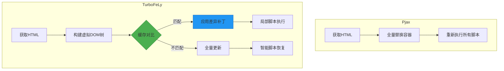
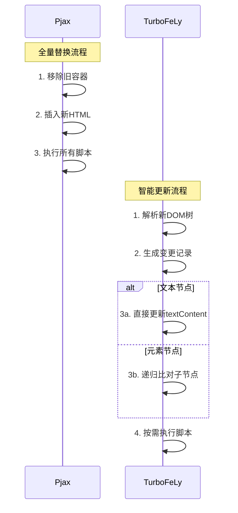
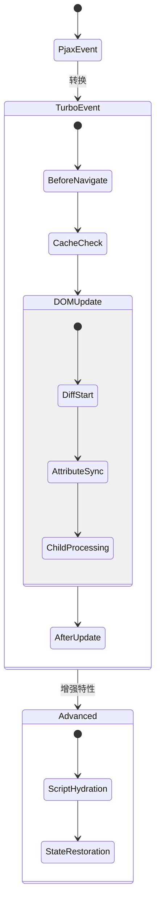
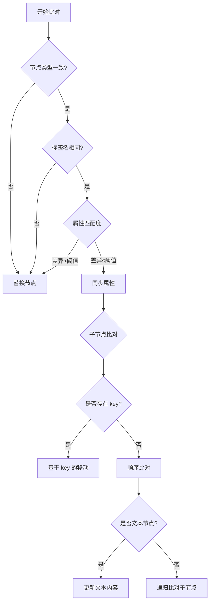
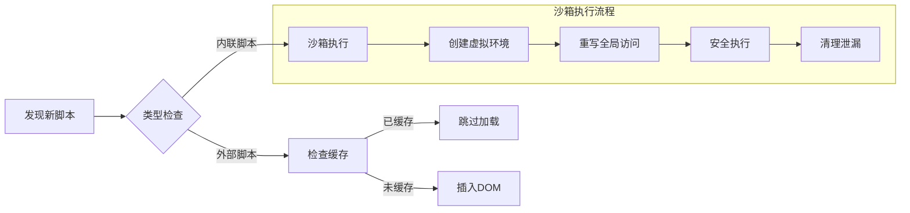
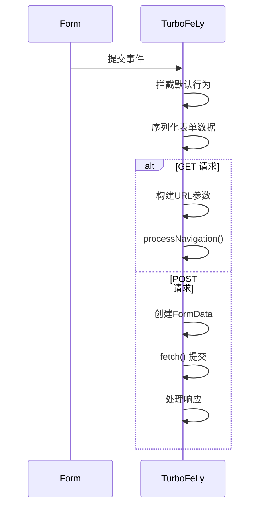
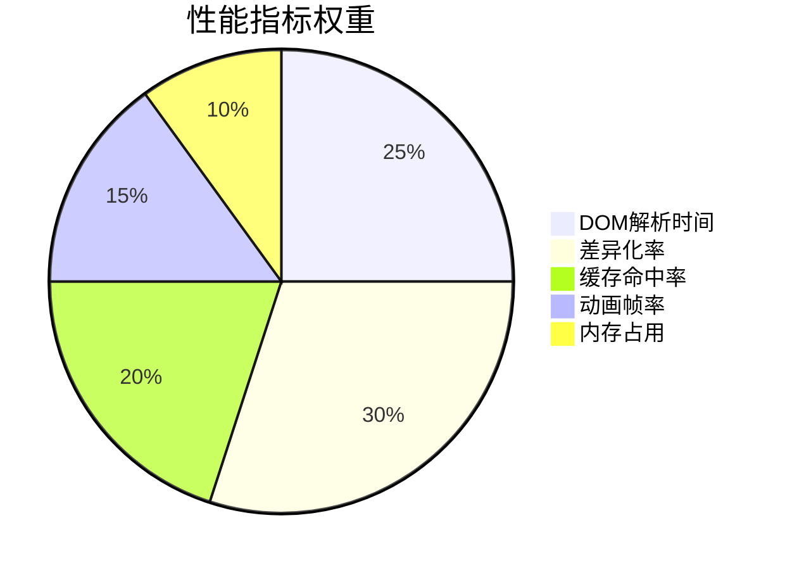

# 从 Pjax 迁移到 TurboFeLy

## 核心架构技术对比

### 1. DOM 更新引擎原理


### 2. 缓存机制实现差异
```mermaid
classDiagram
    class PjaxCache {
        + store: Object
        + get(key): String
        + set(key, value): void
    }
    
    class TurboCache {
        + maxSize: Number
        + ttl: Number
        + lruKeys: Array
        + storage: Map
        + get(key): <html: String, expireAt: Number>
        + set(key, value): void
        + prune(): void
    }
    
    interface LRUAlgorithm {
        + updateLRU(key): void
    }
    
    interface TTLExpiration {
        + checkExpiration(key): Boolean
    }
    
    interface DimensionIsolation {
        + isolate(key): void
    }
    
    TurboCache <|-- LRUAlgorithm
    TurboCache <|-- TTLExpiration
    TurboCache <|-- DimensionIsolation
```

## 分模块技术迁移方案

### 1. 配置项映射表
| Pjax 配置项 | TurboFeLy 等效配置 | 技术差异说明 |
|------------|--------------------|-------------|
| `elements` | `linkSelector` | 支持 CSS4 选择器语法 |
| `selectors` | `container` | 支持多个容器级联 |
| `cacheBust` | `fetchHeaders` | 使用现代缓存控制头 |
| `timeout` | `prefetchDelay` | 分场景延迟配置 |

```javascript
// 迁移示例
// Pjax
new Pjax({
  elements: "a:not([data-no-pjax])",
  selectors: ["#main"],
  cacheBust: true
})

// TurboFeLy
new TurboFeLy({
  linkSelector: 'a:not([data-turbo-disable])',
  container: '#main',
  fetchHeaders: { 
    'Cache-Control': 'no-cache',
    'X-TurboFeLy': 'true'
  }
})
```

### 2. DOM 处理技术升级


#### 迁移时需要修改的代码模式：
```javascript
// Pjax 典型模式（需改造）
document.querySelector('#main').innerHTML = newContent
initComponents() // 需要手动重新初始化

// TurboFeLy 优化模式
// 自动完成DOM差异更新
// 通过 data-turbo-id 保留状态
<div data-turbo-id="user-panel">
  <!-- 动态内容 -->
</div>
```

### 3. 事件系统技术迁移


#### 事件监听器改造示例：
```javascript
// Pjax 事件
document.addEventListener('pjax:send', () => {
  NProgress.start()
})

// TurboFeLy 等效实现
document.addEventListener('turbo:before-navigate', ({ detail }) => {
  if (!detail.canceled) {
    NProgress.start()
    
    // 新增访问控制能力
    if (detail.url.includes('/admin')) {
      detail.preventDefault()
      redirectToLogin()
    }
  }
})
```

## 关键技术点深度解析

### 1. 差异更新算法实现


### 2. 缓存存储结构设计
```javascript
// TurboFeLy 缓存条目结构
{
  html: "<div>...</div>",    // 原始HTML
  timestamp: 1696147200000,  // 缓存时间戳
  expireAt: 1696150800000,   // 过期时间
  scroll: { x: 0, y: 300 },  // 滚动位置
  metadata: {
    viewport: "1920x1080",   // 视口维度
    userAgent: "Chrome/117", // UA信息
    checksum: "a1b2c3d4"     // 内容校验和
  }
}
```

## 高级技术迁移方案

### 1. 脚本执行管理


#### 迁移时需注意：
```html
<!-- Pjax 需要全量执行的脚本 -->
<script src="analytics.js"></script>

<!-- TurboFeLy 优化写法 -->
<script src="analytics.js" data-turbo-permanent></script>
```

### 2. 表单处理技术升级


#### 迁移示例：
```javascript
// Pjax 表单处理
$(document).on('submit', 'form', function(e) {
  e.preventDefault()
  $.pjax.submit(e, '#main')
})

// TurboFeLy 实现
document.querySelector('form').addEventListener('submit', async (e) => {
  e.preventDefault()
  
  const form = e.target
  const url = new URL(form.action)
  const formData = new FormData(form)

  if (form.method === 'get') {
    url.search = new URLSearchParams(formData)
    turbo.processNavigation(url.href)
  } else {
    const response = await fetch(url, {
      method: form.method,
      body: formData
    })
    turbo.handleResponse(response)
  }
})
```

## 性能优化迁移策略

### 1. 预加载机制对比

```mermaid
gantt
    title 预加载策略对比
    dateFormat  ss
    axisFormat %S秒
    
    section Pjax
    手动预加载 :a1, 0, 2s
    
    section TurboFeLy
    视口预测 :crit, a2, 0, 1s
    链路预取 :a3, after a2, 2s
    行为分析 :a4, after a3, 3s
```


### 2. 内存优化配置
```javascript
new TurboFeLy({
  cacheSize: 15, // 根据内存容量调整
  diffThreshold: 0.7, // 降低比对强度
  maxDiffDepth: 25, // 限制递归深度
  animationMemory: {
    maxFrames: 5, // 最大缓存动画帧
    poolSize: 10   // 对象池大小
  }
})
```

## 调试与验证方案

### 1. 差异更新调试器
```javascript
// 启用调试模式
new TurboFeLy({
  debug: {
    domChanges: true,  // 打印DOM变更
    cacheStatus: true, // 显示缓存状态
    diffVisual: true   // 可视化差异节点
  }
})

// 控制台输出示例
[TurboFeLy Debug] DOM changes detected:
- UPDATE #header (textContent)
- REPLACE .old-widget (depth 3)
- ADD 2 new .product-card items
```

### 2. 性能验证指标


本技术迁移方案聚焦核心实现细节，涵盖 DOM 处理、缓存机制、脚本执行等关键技术点。建议通过以下步骤实施：
1. 逐步替换选择器配置
2. 重构事件监听系统
3. 添加 Turbo 专用数据属性
4. 实施渐进式缓存策略
5. 验证性能关键指标
6. 部署监控和回滚方案

遇到具体技术问题时，可参考 TurboFeLy 的调试模式输出和变更记录进行针对性优化。
